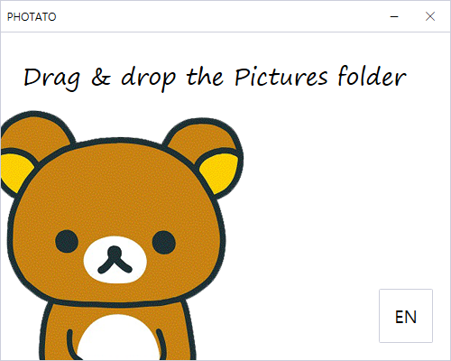

# PHOTATO
Image File Rename Program 📸

Align the image file by renaming it with the combination 'Alphabet' + 'Number'.

> EX) A1.png, A2.jpg, A3.png … B11.gif, B12.png

## PHOTATO App UI

#### 20.09.20 update
Added the console version and modified code.

## License

Copyright 2020. remk0202 all right reserved

##### ⚠ This is the Toy Project. Use safer and better programs.